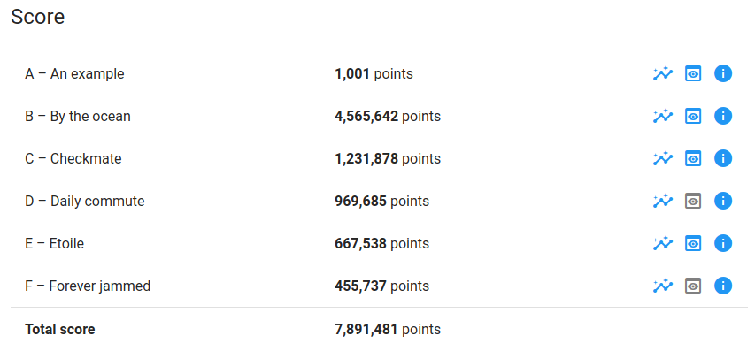

# Google-Hash-Code-2021
## TEAM 127.0.0.1 Sapienza


Our naive solution for the Google-Hash-Code-2021.
During the online qualification we reach the 4075 🌎 place at the global position  and the 179 🇮🇹 place in Italy (our country).

## Usage
```sh
python3 main.py
```

## Score


## Authors - 127.0.0.1 Sapienza Team member<br>
N.B: Alphabetical order <--> fair contribution
*   **Andrea Bacciu**  - [github](https://github.com/andreabac3)
*   **Emanuele Giona**  - [github](https://github.com/emanuelegiona)
*   **Alessandro Scandone**  - [github](https://github.com/ascandone)
*   **Riccardo Taiello**  - [github](https://github.com/Riccardinho22)
